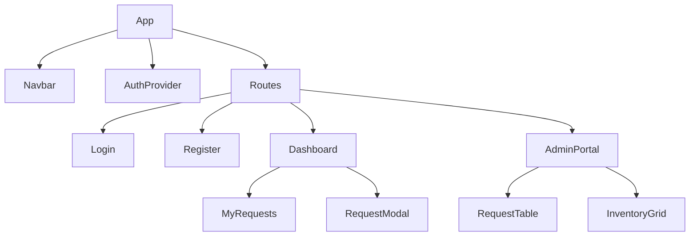

# Architecture & Design Document

## System Overview
Nexus follows a client-server architecture with a clear separation of concerns between the React frontend and Spring Boot microservice.

## Component Hierarchy (Frontend)

## Database Schema (ERD)
- **Users**: Stores credentials and roles.
- **Equipment**: Stores item details, quantity, and status.
- **BorrowRequests**: Links Users to Equipment with dates and status.

## Key Design Decisions
1. **JWT Authentication**: Used for stateless security, allowing the server to remain lightweight.
2. **H2 Database**: Selected for the assignment to ensure the instructor can run the code without complex DB setup.
3. **Vanilla CSS**: Used to demonstrate core CSS skills (Variables, Flexbox, Grid) as requested, while maintaining a premium look.
4. **Data Seeding**: Automatically populates the system with demo data on startup to facilitate immediate demonstration.

## UI/UX Wireframes
- **Dashboard**: Features a search bar at the top and a grid of "Resource Cards" with real-time status badges.
- **Admin Portal**: Uses a tabbed interface to switch between operational tasks (requests) and administrative tasks (inventory).
